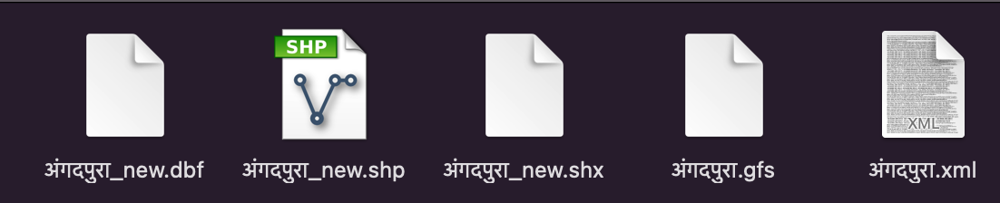

# xml-to-shape 

## Krishna G. Lodha (krishnaglodha.com)

This script will allow user to convert `xml` files available in this folder to `Shapefiles`.

### Prerequisite to run script

1. `GDAL` must be available on command line 

To check this , open command prompt and type `ogr2ogr`,

 if it gives error as command not found, install GDAL using https://sandbox.idre.ucla.edu/sandbox/tutorials/installing-gdal-for-windows

2. Once installation is done,copy all `.xml` files in `files` folder and open Command prompt in the folder
3. Run the script by typing command `sh convert.sh`

This will convert XML files to shapefile OneByOne

4. All `Shapefiles` will be available in the same folder

   